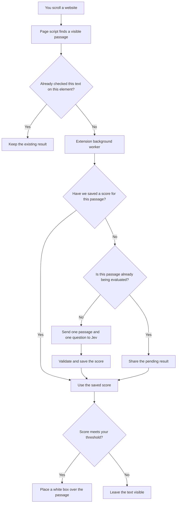

# Slop Shield

A Chrome extension that covers likely AI-style filler with white boxes, powered by [Jev](https://docs.typesafe.ai/introduction/quickstart). Click a box to reveal the original text.

- One Jev request per passage, with one `is_slop` question.
- Persistent score caching across scrolling, page reloads, and browser restarts.
- Identical passages checked concurrently share a single pending request.
- Per-site controls and an adjustable detection threshold.
- A request inspector showing JSON requests, responses, scores, HTTP errors, timing, cache hits, and shared requests.
- Plain JavaScript, Manifest V3, no runtime dependencies or build step.

## Install

1. Download the extension ZIP from [Releases](https://github.com/rishiv7/slop-shield/releases/latest) and unzip it.
2. Open `chrome://extensions` and enable **Developer mode**.
3. Click **Load unpacked** and select the extracted `slop-shield-chrome` folder containing `manifest.json`.
4. Pin Slop Shield through Chrome's Extensions menu.
5. Open **Slop Shield → Settings**, paste your own API key from the [TypeSafe console](https://console.typesafe.ai), and click **Save settings → Test connection**.
6. Visit a website, open Slop Shield, and enable **Filter this site**. Chrome will ask for access to that site.

Alternatively, clone this repository and load its **`extension` subfolder**, not the repository root. Node.js is needed only to run tests, not to use the extension. This is an unpacked extension, not a Chrome Web Store release.

To update an existing installation, replace its extension files, click **Reload** in `chrome://extensions`, then refresh open website tabs. Settings and cached scores are retained when the extension identity and profile stay the same.

## Controls

| Control | Behavior |
| --- | --- |
| Site switch | Enable automatic filtering for the current origin. |
| Threshold | Hide passages scoring at least this value; default 85/100. |
| White box | Click, or keyboard-focus and activate, to reveal the text. |
| Reveal all | Remove covers and pause the current page until rescan or reload. |
| Rescan page | Reset page scanning and reveal choices; reuse cached scores. |
| Request log | Inspect recent API exchanges and cache activity. |

## How it works

There are three main parts: a small script that reads the page, a background worker that manages decisions, and Jev, the external AI service. There is no separate server to deploy.



### Follow a single tweet

1. **You scroll it into view.** The page script looks for visible text. On X, it recognizes common tweet-text containers. It also supports paragraphs, list items, and quotations on other sites. It reads text that is already on the page; it does not call the X API.
2. **The script checks whether the text is new.** Unchanged elements already checked on that page are skipped. New text goes to the background worker through Chrome's extension messaging.
3. **The worker checks its saved scores.** It identifies a passage by its text, not by the temporary HTML element displaying it. If X removes a tweet from the page and recreates it when you scroll back, its cached score can still be reused.
4. **Only an uncached passage needs Jev.** The worker sends one passage and asks one question: “Is this passage AI-style slop?” If another tab is already asking about the same passage, both tabs share that request.
5. **Jev returns a score from 0 to 1.** The worker checks that the response is valid, saves the score, and returns it to the page script. Errors leave unclassified text visible and pause the scan until you retry.
6. **The page script applies your threshold.** At the default setting, a score of 0.85 or higher produces a white box. Click the box to reveal the original text.

### What goes to Jev?

One HTTP request contains one text passage and one evaluation question. Here is a shortened example; the complete wording lives in [`extension/jev.js`](extension/jev.js).

```json
{
  "model": "jev-latest",
  "state": "The passage being evaluated...",
  "questions": {
    "is_slop": {
      "type": "noul",
      "instructions": "Is the passage in state low-value, formulaic AI-style filler?",
      "criteria": {
        "true": "Low-information, formulaic filler",
        "false": "Concrete information, useful details or distinctive insight"
      }
    }
  }
}
```

The background worker sends this directly to TypeSafe's `https://api.typesafe.ai/v1/systemone` endpoint. Your API key is attached to that request by the worker; the page script never receives the key. The score comes back in `answers.is_slop.noul`.

### What is stored, and where?

| Information | Location | How long it lasts |
| --- | --- | --- |
| Checked page elements and reveal choices | Page script memory | Until the page reloads or its scan is reset |
| API key, enabled sites, and threshold | Local extension storage | Until changed, cleared, or the extension is removed |
| Passage fingerprints and scores | Local extension storage | Across reloads and browser restarts; up to 10,000 scores |
| Recent requests and responses | Extension session storage | Latest 100 events; cleared on browser restart or extension reload |

A **fingerprint** is a hash calculated from the text, model name, and complete evaluation question. The score cache stores this fingerprint and score, not the original passage. The separate request log does contain passage text so you can inspect what happened.

Extra whitespace is normalized before looking up a passage. Identical text can reuse its score across sites and tabs. Changing the threshold or API key does not erase scores. Changing the text or evaluation question creates a new fingerprint and requires a fresh evaluation.

When the cache fills up, older, less recently used entries are removed. A removed entry can require another API call later. Failed evaluations are not saved. If TypeSafe changes the model behind the `jev-latest` name, this version does not automatically expire previously saved scores.

## Request log

Open **Request log** from the extension popup or Settings. Select an event to inspect it.

- **Jev API:** passage, request body, raw response body, HTTP status, elapsed time, score, and errors. Connection tests are included.
- **Cache hit:** a saved score was reused; no API request was sent.
- **Shared request:** another evaluation was already pending; no additional request was sent.

Filter events, export JSON, pause recording, or clear the log. Clearing logs does not clear classification scores. Recording is on by default for the browser session. Already-recorded requests may finish updating after recording is paused.

The latest **100 events** are held in trusted extension session storage. They survive worker suspension but clear on browser restart or extension reload. Response previews are capped at **16 KB** and marked when truncated. The authorization header is excluded; the active key is redacted if echoed in a body or error. Historical response bodies cannot be reconstructed from cached scores.

## Data and permissions

- Filtering is off until you enable a site. Only TypeSafe API access is granted at install; website access is requested when enabling a site.
- Visible passage text goes directly to TypeSafe. API payloads do not include page URLs, cookies, form-field values, or browsing history. Passage text itself can contain private information.
- Forms, editable areas, navigation, code blocks, and hidden elements are excluded on a best-effort basis. This is not a sensitive-data sanitizer.
- Your API key is stored in `chrome.storage.local`, restricted to trusted extension contexts. It is not synced or separately encrypted by this extension. Page scripts and content scripts cannot read it.
- Request logs include actual passage text and site origins locally. Exported logs contain those details. No analytics or automatic log uploads.
- Turning off a site stops filtering and removes its automatic script registration. Previously granted Chrome host permission remains available for re-enabling; revoke it separately in Chrome if desired.
- Browser-visible page modifications, including the cover elements, are detectable by the website. This extension does not promise invisibility.
- API access and charges belong to your TypeSafe account. No key is bundled. See [TypeSafe's privacy policy](https://typesafe.ai/legal/privacy-policy).

## Limits

The rubric estimates AI-style filler; it does not establish authorship and has not been accuracy-benchmarked. Every cover is reversible, and original text remains in the DOM.

Passages must be **80–4,000 characters**. Each scan checks up to **120 passages**, with one pending evaluation per page and up to four network evaluations across the extension. A document has an in-memory hourly limit of 360 uncached evaluations; worker restarts reset that guardrail. Requests time out after 20 seconds, with no automatic paid retries. These are usage guardrails, not a provider billing cap.

Images, video, embedded frames, browser pages, Chrome Web Store pages, PDFs, and shadow-root content are outside this version's scope. Unusual layouts can interfere with selection or covers. X-specific behavior has not been validated against live X; browser integration was exercised using controlled fixtures and simulated API responses.

## Development

With Node.js 20 or newer:

```sh
npm test
```

There are no dependencies to install. The tests cover request shape, response validation, failure handling, persistent caching, duplicate suppression, log retention, redaction, and response capture. They make no paid API calls.

| File | Purpose |
| --- | --- |
| `extension/background.js` | API broker, settings, quotas, and site registration |
| `extension/content.js` | Text selection, dynamic-page observation, and covers |
| `extension/jev.js` | Single-passage API client and classification rubric |
| `extension/score-cache.js` | Persistent score cache and pending-request sharing |
| `extension/request-log.js` | Session logging and response capture |
| `extension/logs.*` | Request inspector and export controls |
| `extension/popup.*`, `extension/options.*` | User controls and settings |

Protocol reference: [TypeSafe HTTP API](https://docs.typesafe.ai/api) and [Noul questions](https://docs.typesafe.ai/primitives/noul).
