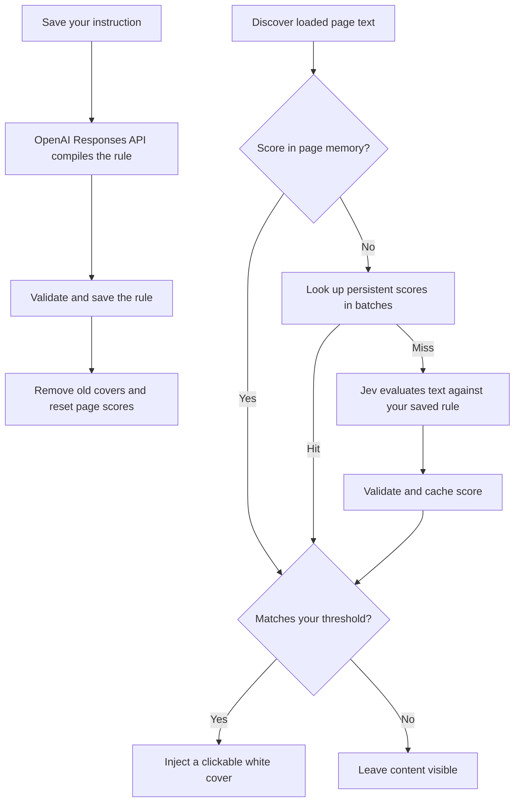

# Content Blocker

A Chrome extension that filters page text using one personal instruction. Write **“No travel-related content, but allow local news”** in the popup. Your own OpenAI API key compiles that preference into a classification rule, and Jev evaluates passages against that rule. Matching text receives a white cover that you can click to reveal. A flagged tweet gets one cover over its entire article, including attached images; revealing it shows the text and images together.

This replaces the previous fixed AI-slop classifier. Nothing is filtered until you save an instruction and enable a site. To block AI-style filler, describe that preference in your instruction.

## Install and set up

1. Unzip the extension download, or clone this repository.
2. Open `chrome://extensions`, enable **Developer mode**, and choose **Load unpacked**.
3. Select the **`extension` folder** containing `manifest.json`.
4. Open **Content Blocker → Settings**. Enter your **TypeSafe API key** and your **OpenAI API key**, then save. Existing TypeSafe keys and site settings are retained when updating the same installation.
5. Open the popup, enter your instruction, and select **Save & apply**. The active-filter summary describes the generated rule.
6. Visit a site and turn on **Filter this site** in the popup. Chrome requests access to that site.

The OpenAI key is used only to compile new rules; the TypeSafe key is used for Jev content evaluations. A blank key field preserves its saved key; use **Remove saved TypeSafe key** or **Remove saved OpenAI key** to delete either. The OpenAI key is used when you save a new filter. An existing filter keeps working if you remove this key.

When updating, replace the files in the folder Chrome already loads, click **Reload** in `chrome://extensions`, and refresh website tabs. Version 2.2 restores direct OpenAI access: the manifest now requests `https://api.openai.com/*`; approve Chrome's permission update if prompted. Upgrading from Slop Shield does not automatically carry forward AI-slop blocking: save your first custom instruction.

## Controls

| Control | Behavior |
| --- | --- |
| Your filter | One natural-language instruction, up to 2,000 characters, shared across enabled sites. |
| Save & apply | Compile with OpenAI (`gpt-6-luna`) and apply to enabled tabs. The previous rule stays active if compilation fails. Saving the unchanged active instruction reuses it. |
| Clear filter everywhere | Remove the active rule and covers. Site preferences remain saved; no model request is needed. |
| Filter this site | Enable or disable the current website's origin. |
| Block short-form video | Deterministically suppress YouTube Shorts, TikTok, and Instagram/Facebook Reels on enabled sites. Needs no API key or filter. |
| Confidence threshold | Cover passages scoring at least this value; default 85/100. |
| White cover | Click, or keyboard-focus and activate, to reveal. A tweet cover reveals its text and attached images together. |
| Reveal all | Remove covers and pause this page until rescan, reload, or a new rule. |
| Rescan page | Reset the page's scan budget and reveal choices, reusing scores for the current rule. |
| Request log | Inspect Jev requests, responses, and individual cache/shared evaluation results. |

## How it works



### Instruction compilation

Saving a new instruction sends one direct request to `https://api.openai.com/v1/responses` with your saved OpenAI API key. Only the instruction is sent to OpenAI. The response must contain complete, non-refused JSON with exactly `summary`, `instructions`, `block`, and `allow`; field lengths are validated before the saved rule is replaced. Failed, malformed, refused, or timed-out requests keep the previous rule active. Changing the instruction or the saved key cancels an in-flight compilation.

The compiler uses the `gpt-6-luna` model with reasoning effort `none`, temperature 0, a 1,600-token output cap, and a strict `blocking_rule` JSON schema. Responses are not stored on OpenAI's side (`store: false`), and the extension reuses the unchanged active instruction without a model call. Filters compiled by an older compiler version recompile the next time you save them; existing filters keep working until then.

Explicit allow exceptions override block topics, including when a passage matches both. For example, “no travel except local news” allows local travel news, while “only show cats” blocks content outside that topic. Jev receives the original preference and instructions to treat page content as untrusted, honor exceptions, and allow ambiguous passages. Model interpretation can still be wrong; review the summary and adjust the instruction as needed.

`npm run test:openai` runs one real compilation against the live API and reports the parsed rule and latency. It requires `OPENAI_API_KEY` in the environment and performs one paid request.

### Page classification and caching

The page script discovers eligible text throughout the mounted DOM, including off-screen content. Visible and nearby passages are prioritized. It never fetches unloaded tweets or calls a website's private API. Nested tweet text is kept together. A flagged tweet covers its enclosing article, so attached images (including images loaded later) are covered without extra API calls. Multiple flagged text passages in the same tweet share one cover and one reveal action. Generic page text retains passage-sized covers.

Page memory retains up to 10,000 recent text scores after their DOM nodes disappear. Returning tweets can receive covers without another background message. Persistent cache probes run in batches of 64 independently of slow Jev evaluations, and cache hits still work when the new-evaluation budget is exhausted or an API error has paused new requests.

Jev receives one passage and one question named `should_block`. The question changes with your saved instruction. A positive score means the text should be blocked. The background worker validates the result before saving it; failed evaluations are not cached.

Persistent scores are keyed by a SHA-256 hash of the complete Jev request: text, model, and compiled rule. Different rules cannot reuse each other's decisions. Changing a rule clears page-memory scores and old covers, cancels old network evaluations, and rejects stale requests. Old persistent scores can only be reused when the complete request matches. Threshold changes reuse scores without recompiling a rule.

### Short-form video blocking

A global **Block short-form video** toggle in the popup enables a deterministic suppression layer for YouTube Shorts, TikTok, and Instagram/Facebook Reels on enabled sites. It is separate from the text pipeline: no TypeSafe key, no Jev request, no classification — everything is DOM and URL logic in `extension/short-form.js`, registered at `document_start` so suppression exists before the first paint of a hard navigation.

Two modes per site, driven by one SURFACES table in the engine:

- **Page mode** — the route itself is short-form (`youtube.com/shorts/<id>`, `instagram.com/reels/…`, `facebook.com/reel/<id>`, TikTok's home feed). A scope attribute on `<html>` hides the media region while the header and navigation stay visible, and a small inert "Short-form video blocked" placeholder appears. There is no reveal control for video.
- **Item mode** — in-feed elements that link to short-form content collapse to the same inert chip. Anchoring prefers the item's own link path (`/shorts/`, `/video/`, `/reels`, `/reel/`) over volatile class names, so ordinary results and posts stay visible.

Inside suppressed regions every `<video>` is paused and `autoplay` is stripped; a capture-phase `play` listener re-pauses programmatic playback. In-feed Short/Reel transitions are SPA navigations, so the engine re-derives the page mode on `pushState`, `replaceState`, `popstate`, and DOM mutations. Turning the toggle off (or disabling the site) removes the stylesheet, scope attributes, listeners, and history patch in one teardown — the page returns to stock with no residue.

Selector rows in the SURFACES table carry verification dates. When a site ships new markup, a selector miss fails visible — content shows normally — until the row is refreshed; the fix is always a table row, never page logic. TikTok users who want the whole site gone already have the per-site switch: short-form mode is the finer instrument for keeping TikTok while suppressing the feed.

## Data and permissions

| Information | Where it lives / where it goes |
| --- | --- |
| TypeSafe API key | Trusted extension local storage, not synced; used only by the background worker. |
| OpenAI API key | Trusted extension local storage, not synced; used only by the background worker to compile rules. Never sent to any page or to TypeSafe. |
| Original instruction and compiled rule | Trusted local extension storage; the instruction goes to OpenAI when compiling, and the compiled rule accompanies Jev evaluations. |
| Eligible page text | Goes to TypeSafe for uncached evaluations on enabled sites, including off-screen text already loaded. Never sent to OpenAI by this extension. |
| Recent text and scores | Page memory, up to 10,000 scores; reset on reload or rule change. |
| Passage fingerprints and scores | Local extension storage, up to 10,000 entries across reloads and browser restarts. |
| Jev request log | Trusted extension session storage, latest 100 events, cleared on browser restart or extension reload. |

API payloads do not include page URLs, cookies, or form-field values. Passage text can still contain private information. Forms, editable areas, navigation, code, and hidden elements are excluded on a best-effort basis. The extension adds no encryption to locally stored keys and has no analytics or automatic log uploads.

Filtering is off on a website until enabled. Disabling a site removes its automatic script registration; its Chrome host permission remains available for re-enabling unless revoked separately in Chrome.

## Request log

The inspector records Jev request bodies (including your rule), response bodies, scores, status codes, timing, errors, and individual cache/shared results. Compilation requests, batch cache probes, and page-memory reuse are not logged individually. Logs contain passage text and site origins locally; exports contain those details. Authorization headers are excluded and the active TypeSafe key is redacted from logged data.

Recording can be paused or cleared independently of cached classification scores. Response previews are limited to 16 KB. In-flight requests may finish updating existing events after recording is paused.

## Limits

- Filtering decisions use **text passages**. On X/Twitter, a flagged tweet’s entire article is covered, including attached images and other media. Image-only tweets are not independently classified. Generic pages keep text-only covers. Embedded frames, PDFs, shadow-root content, browser pages, and Chrome Web Store pages are outside its scope.
- Tweet text may be as short as one character; other page passages must be at least 20 characters. All passages are limited to 4,000 characters. No image, audio, author-profile, or video interpretation is performed.
- Each scan permits **120 new Jev API evaluations**, with one pending evaluation per page and up to four across the extension. Cached and shared scores do not consume the page budget. Up to 10,000 distinct passages can be queued at once.
- Each document has an in-memory limit of 360 uncached evaluations per hour; worker restarts reset this guardrail. It is not a provider billing cap.
- Jev requests time out after 20 seconds. OpenAI compilation times out after 25 seconds. There are no automatic paid retries.
- Classification is probabilistic. Covers do not remove the underlying DOM text and can be revealed. Unusual website layouts can affect selection and overlay placement.
- Browser validation is left to the user. Automated checks cover the compiler and background messaging with mocked API responses; `npm run test:openai` calls the live model once.

Short-form video blocking is deterministic DOM/URL logic, not interpretation: it suppresses the surfaces listed in the engine's SURFACES table and makes no judgment about other video. Selector rows are dated — YouTube rows were verified live (2026-09-24); TikTok, Instagram, and Facebook rows were verified against fixture structures only, because the live sites are login/bot-walled from the verification environment, so suppression there fails visible until their rows are re-verified. Page mode hides media regions, never site chrome, and a selector miss leaves content visible rather than blanking the page. With the toggle off, behavior is unchanged from the text-only extension.

## Development and testing

The extension is plain HTML, CSS, and JavaScript; load it without a build step.

```sh
npm ci
npm test            # automated compiler, background, and DOM tests; no paid requests
npm run test:openai # one real compilation with OPENAI_API_KEY from the environment
```

The tests cover strict JSON validation, exceptions in the Jev prompt, refusals, HTTP error mapping, request cancellation, settings access, existing-rule migration, legacy OpenAI keys, unchanged-instruction reuse, and stale compilation races. Browser testing remains manual. Jev's existing classification and caching paths are unchanged. Automated DOM checks cover tweet images, late-loaded media, shared reveal, recycled tweets, threshold changes, disabling, and ordinary text passages. The short-form engine has its own suite covering SURFACES scoping, page and item modes, SPA transitions, teardown, and the manifest permission invariants.

| File | Purpose |
| --- | --- |
| `extension/rule-compiler.js` | OpenAI Responses API request, output validation, and cancellation |
| `scripts/test-openai.mjs` | Live single-compilation smoke test against the real API |
| `extension/jev.js` | Jev classifier using the saved custom question |
| `extension/background.js` | Rules, compilation, API broker, caches, quotas, and site registration |
| `extension/content.js` | Text discovery, page-memory scores, rule invalidation, and overlays |
| `extension/short-form.js` | Deterministic short-form suppression: SURFACES table, page and item modes, media stop, SPA re-derivation |
| `extension/score-cache.js` | Persistent scores, batch lookup, and pending-request sharing |
| `extension/popup.*` | Global instruction editor and current-site controls |
| `extension/options.*` | OpenAI key, TypeSafe key, threshold, and enabled sites |
| `extension/request-log.js`, `extension/logs.*` | Jev logging and inspection |
